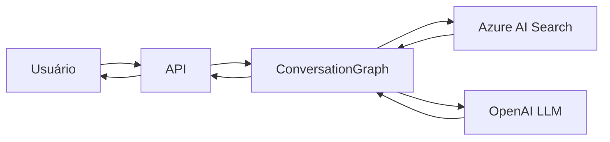

<div align="center">

# 🤖 ChatRAG

### Chatbot Inteligente com RAG (Retrieval-Augmented Generation)

[](https://www.python.org/)
[](https://fastapi.tiangolo.com/)
[](https://www.langchain.com/)
[](https://www.docker.com/)
[](https://azure.microsoft.com/)

</div>

______________________________________________________________________

## 📋 Índice

- [Sobre o Projeto](#-sobre-o-projeto)
- [Características](#-caracter%C3%ADsticas)
- [Arquitetura](#-arquitetura)
- [Decisões Técnicas](#-decis%C3%B5es-t%C3%A9cnicas)
- [Tecnologias](#-tecnologias)
- [Pré-requisitos](#-pr%C3%A9-requisitos)
- [Instalação](#-instala%C3%A7%C3%A3o)
- [Configuração](#-configura%C3%A7%C3%A3o)
- [Uso](#-uso)
- [Estrutura do Projeto](#-estrutura-do-projeto)
- [API Endpoints](#-api-endpoints)
- [Desenvolvimento](#-desenvolvimento)
- [Docker](#-docker)
- [Contribuindo](#-contribuindo)
- [Licença](#-licen%C3%A7a)

______________________________________________________________________

## 🎯 Sobre o Projeto

**ChatRAG** é uma aplicação de chatbot inteligente que combina o poder do **Retrieval-Augmented Generation (RAG)** com modelos de linguagem avançados. O sistema utiliza Azure AI Search para recuperação de informações e OpenAI para geração de respostas contextualizadas e precisas.

### Por que ChatRAG?

- 🎯 **Respostas Contextualizadas**: Combina conhecimento recuperado com IA generativa
- 🔍 **Busca Semântica**: Utiliza embeddings para encontrar informações relevantes
- 🔄 **Conversações com Estado**: Mantém o contexto através de múltiplas interações
- ⚡ **Performance**: API rápida e eficiente construída com FastAPI
- 🐳 **Fácil Deploy**: Totalmente containerizado com Docker

______________________________________________________________________

## ✨ Características

- 🤖 **Chatbot Inteligente** com capacidade de manter contexto conversacional
- 🔎 **RAG (Retrieval-Augmented Generation)** para respostas baseadas em documentos
- 🧠 **LangGraph** para orquestração de fluxos de conversação complexos
- 📊 **Azure AI Search** para indexação e busca vetorial de alta performance
- 🚀 **API REST** completa com documentação automática (Swagger/ReDoc)
- 🔐 **Configuração Segura** via variáveis de ambiente
- 🐳 **Docker Support** com Docker Compose para deploy simplificado
- ✅ **Health Checks** para monitoramento da aplicação
- 🔄 **CORS Configurado** para integração com frontends
- 💬 **Sistema de Clarificação Inteligente** - O agente pode fazer perguntas de volta ao usuário quando precisa de mais contexto

> **📝 Nota sobre Clarificações**: Uma "clarificação" ocorre quando a IA, ao analisar a pergunta do usuário e o contexto recuperado, identifica que precisa de informações adicionais para fornecer uma resposta precisa. Nesses casos, o agente responde com uma pergunta direcionada ao usuário. O sistema rastreia o número de clarificações para evitar loops infinitos, limitando-as a um máximo configurável (padrão: 2) antes de transferir para atendimento humano se necessário.

______________________________________________________________________

## 🏗️ Arquitetura

O projeto segue princípios de **Clean Architecture** e **Domain-Driven Design (DDD)**:

```
┌─────────────────┐
│   API Layer     │  ← FastAPI Routes
├─────────────────┤
│  Application    │  ← Business Logic & LangGraph
├─────────────────┤
│    Domain       │  ← Core Domain Models
├─────────────────┤
│ Infrastructure  │  ← External Services (OpenAI, Azure)
└─────────────────┘
```

### Fluxo de Conversação



______________________________________________________________________

## 🎓 Decisões Técnicas

### Por que LangChain e LangGraph?

#### **LangChain: O Framework Ideal para LLM Applications**

O **LangChain** foi escolhido como base deste projeto pelos seguintes motivos:

🔗 **Abstração Poderosa**

- Fornece componentes modulares e reutilizáveis para trabalhar com LLMs
- Facilita a integração com múltiplos provedores (OpenAI, Azure, Anthropic, etc.)
- Reduz significativamente o boilerplate code

🔄 **RAG Simplificado**

- Implementação nativa de Retrieval-Augmented Generation
- Suporte integrado para vector stores (Azure AI Search, Pinecone, Weaviate)
- Gerenciamento automático de embeddings e similarity search

📝 **Prompt Engineering**

- Templates de prompts estruturados e parametrizáveis
- Chain of Thought e outras técnicas avançadas já implementadas
- Facilita testes e versionamento de prompts

🧩 **Ecosystem Rico**

- Mais de 700+ integrações prontas
- Comunidade ativa e documentação extensa
- Padrões estabelecidos e best practices

#### **LangGraph: State Machine para Conversações Complexas**

O **LangGraph** complementa o LangChain trazendo:

🔀 **Fluxos Condicionais**

- Permite criar workflows complexos com branches e loops
- Controle fino sobre o fluxo de conversação
- Suporte a estados e transições explícitas

💾 **Gerenciamento de Estado**

- Checkpointing automático para persistência de conversas
- Memory saver integrado para contexto de longo prazo
- Rollback e replay de conversações

🎯 **Arquitetura de Agentes**

- Suporte nativo para multi-agentes
- Orquestração de diferentes LLMs e ferramentas
- Perfeito para implementar padrões como ReAct e Plan-and-Execute

### Outras Decisões Arquiteturais

#### **Clean Architecture + DDD**

```
✅ Separação clara de responsabilidades
✅ Domínio isolado de detalhes de infraestrutura
✅ Facilita testes e manutenção
✅ Permite troca de dependências sem impacto no core
```

#### **FastAPI como Framework Web**

- Performance comparável a Node.js e Go
- Validação automática com Pydantic
- Documentação OpenAPI gerada automaticamente
- Type hints nativos para melhor DX

#### **Azure AI Search para Vector Store**

- Busca híbrida (vetorial + keyword)
- Escalabilidade enterprise-grade
- Integração nativa com Azure ecosystem
- Filtros e facetas avançadas

#### **UV para Gerenciamento de Pacotes**

- 10-100x mais rápido que pip
- Lock file determinístico
- Resolução de dependências otimizada
- Compatível com pip e pyproject.toml

#### **Docker Multi-Stage Build**

- Imagens otimizadas e seguras
- Separação de build e runtime
- Health checks integrados
- Fácil deploy em qualquer ambiente

#### **Sistema de Clarificação Inteligente**

O sistema implementa um mecanismo sofisticado de clarificação:

**Como Funciona:**

1. O LLM analisa a pergunta do usuário e o contexto recuperado
1. Se a informação for insuficiente, o agente responde com uma **contra-pergunta**
1. O sistema rastreia o contador de clarificações para cada conversa
1. Após o limite (padrão: 2 clarificações), a conversa é escalada para humano

**Vantagens:**

- ✅ Evita respostas genéricas ou imprecisas
- ✅ Coleta informações específicas antes de responder
- ✅ Melhora a satisfação do usuário com respostas mais precisas
- ✅ Previne loops infinitos de perguntas
- ✅ Handover inteligente para atendimento humano quando necessário

**Exemplo de Fluxo:**

```
Usuário: "Meu sistema está lento"
Agente: "Para te ajudar melhor, qual parte do sistema está apresentando lentidão? 
         É no login, na dashboard, ou em outra funcionalidade específica?"
         [clarification_count: 1]

Usuário: "Na dashboard"
Agente: "Entendi! A lentidão na dashboard pode ser causada por... [resposta completa]"
         [clarification_count: 1, resposta final]
```

______________________________________________________________________

## 🛠️ Tecnologias

### Core

- **[Python 3.11+](https://www.python.org/)** - Linguagem de programação
- **[FastAPI](https://fastapi.tiangolo.com/)** - Framework web moderno e rápido
- **[Pydantic](https://docs.pydantic.dev/)** - Validação de dados

### IA & Machine Learning

- **[LangChain](https://www.langchain.com/)** - Framework para aplicações com LLMs
- **[LangGraph](https://langchain-ai.github.io/langgraph/)** - Orquestração de agentes e workflows
- **[OpenAI](https://openai.com/)** - Modelos de linguagem (GPT-4, embeddings)

### Cloud & Infraestrutura

- **[Azure AI Search](https://azure.microsoft.com/products/ai-services/ai-search)** - Busca semântica e vetorial
- **[Docker](https://www.docker.com/)** - Containerização
- **[uv](https://github.com/astral-sh/uv)** - Gerenciador de pacotes Python ultrarrápido

______________________________________________________________________

## 📦 Pré-requisitos

- **Python 3.11** ou superior
- **Docker** e **Docker Compose** (opcional, para deploy containerizado)
- **Conta OpenAI** com API Key
- **Azure AI Search** com índice configurado

______________________________________________________________________

## 🚀 Instalação

### Opção 1: Instalação Local

1. **Clone o repositório**

```bash
git clone https://github.com/seu-usuario/chatrag.git
cd chatrag
```

2. **Instale o uv** (se ainda não tiver)

```bash
pip install uv
```

3. **Instale as dependências**

```bash
uv sync
```

### Opção 2: Com Docker

```bash
git clone https://github.com/seu-usuario/chatrag.git
cd chatrag
docker-compose up --build
```

______________________________________________________________________

## ⚙️ Configuração

### 1. Crie um arquivo `.env`

```bash
cp .env.example .env
```

### 2. Configure as variáveis de ambiente

```env
# OpenAI Configuration
OPENAI_API_KEY=sk-your-openai-api-key
OPENAI_EMBEDDING_MODEL=text-embedding-ada-002
OPENAI_CHAT_MODEL=gpt-4

# Azure AI Search Configuration
AZURE_SEARCH_ENDPOINT=https://your-search-service.search.windows.net
AZURE_SEARCH_KEY=your-azure-search-admin-key
AZURE_SEARCH_INDEX_NAME=your-index-name

# Application Configuration
APP_HOST=0.0.0.0
APP_PORT=8000
MAX_CLARIFICATIONS=2
```

### 3. Variáveis de Ambiente Disponíveis

| Variável | Descrição | Padrão |
|----------|-----------|--------|
| `OPENAI_API_KEY` | Chave da API OpenAI | *Obrigatório* |
| `OPENAI_EMBEDDING_MODEL` | Modelo de embeddings | `text-embedding-ada-002` |
| `OPENAI_CHAT_MODEL` | Modelo de chat | `gpt-4` |
| `AZURE_SEARCH_ENDPOINT` | Endpoint do Azure AI Search | *Obrigatório* |
| `AZURE_SEARCH_KEY` | Chave de acesso do Azure Search | *Obrigatório* |
| `AZURE_SEARCH_INDEX_NAME` | Nome do índice | *Obrigatório* |
| `APP_HOST` | Host da aplicação | `0.0.0.0` |
| `APP_PORT` | Porta da aplicação | `8000` |
| `MAX_CLARIFICATIONS` | Máximo de clarificações | `2` |

______________________________________________________________________

## 💻 Uso

### Executar Localmente

```bash
# Ative o ambiente virtual do uv
source .venv/bin/activate  # Linux/Mac
# ou
.venv\Scripts\activate  # Windows

# Execute a aplicação
uv run fastapi dev main.py
```

A API estará disponível em: `http://localhost:8000`

### Acessar a Documentação

- **Swagger UI**: http://localhost:8000/docs
- **ReDoc**: http://localhost:8000/redoc

### Exemplo de Requisição

```bash
curl --location 'http://localhost:8000/conversations/completions' \
--header 'Content-Type: application/json' \
--data '{
  "helpdeskId": 1,
  "projectName": "tesla_motors",
  "messages": [
    {
      "role": "USER",
      "content": "Hi! What'\''s the autonomy of a Tesla car?"
    }
  ]
}'
```

______________________________________________________________________

## 📂 Estrutura do Projeto

```
chatrag/
├── 📁 src/
│   ├── 📁 api/              # Rotas e endpoints FastAPI
│   ├── 📁 application/      # Lógica de negócio e LangGraph
│   ├── 📁 domain/           # Modelos de domínio e entidades
│   └── 📁 infrastructure/   # Configurações e serviços externos
├── 📄 main.py               # Ponto de entrada da aplicação
├── 📄 pyproject.toml        # Dependências e metadados
├── 📄 Dockerfile            # Imagem Docker
├── 📄 docker-compose.yml    # Orquestração de containers
├── 📄 .env.example          # Exemplo de variáveis de ambiente
└── 📄 README.md             # Este arquivo
```

______________________________________________________________________

## 🌐 API Endpoints

### Root

- **GET /** - Informações da API

### Health

- **GET /health** - Status da aplicação

### Conversações

- **POST /conversations** - Enviar mensagem e receber resposta
  ```json
    {
      "helpdeskId": 20,
      "projectName": "tesla_motors",
      "messages": [
        {
          "role": "USER",
          "content": "Hi! What's the autonomy of a Tesla car?"
        }
      ]
    }
  ```

### Documentação

- **GET /docs** - Swagger UI
- **GET /redoc** - ReDoc

______________________________________________________________________

## 👨‍💻 Desenvolvimento

### Instalar com dependências de desenvolvimento

```bash
uv sync
```

### Executar em modo desenvolvimento

```bash
uv run fastapi dev main.py
```

### Estrutura de Código

O projeto segue os princípios:

- ✅ **Clean Architecture**
- ✅ **SOLID Principles**
- ✅ **Type Hints** em todo o código
- ✅ **Validação com Pydantic**
- ✅ **Separation of Concerns**

______________________________________________________________________

## 🐳 Docker

### Build da Imagem

```bash
docker build -t chatrag:latest .
```

### Executar Container

```bash
docker run -p 8000:8000 --env-file .env chatrag:latest
```

### Docker Compose

```bash
# Iniciar serviços
docker-compose up -d

# Ver logs
docker-compose logs -f

# Parar serviços
docker-compose down
```

### Health Check

O container possui health check configurado:

```yaml
healthcheck:
  test: python -c "import urllib.request; urllib.request.urlopen('http://localhost:8000/health').read()"
  interval: 30s
  timeout: 10s
  retries: 3
  start_period: 10s
```

______________________________________________________________________

## 📄 Licença

Este projeto está sob a licença MIT.

______________________________________________________________________

<div align="center">

**Desenvolvido com ❤️ usando Python, FastAPI e LangChain**

</div>
